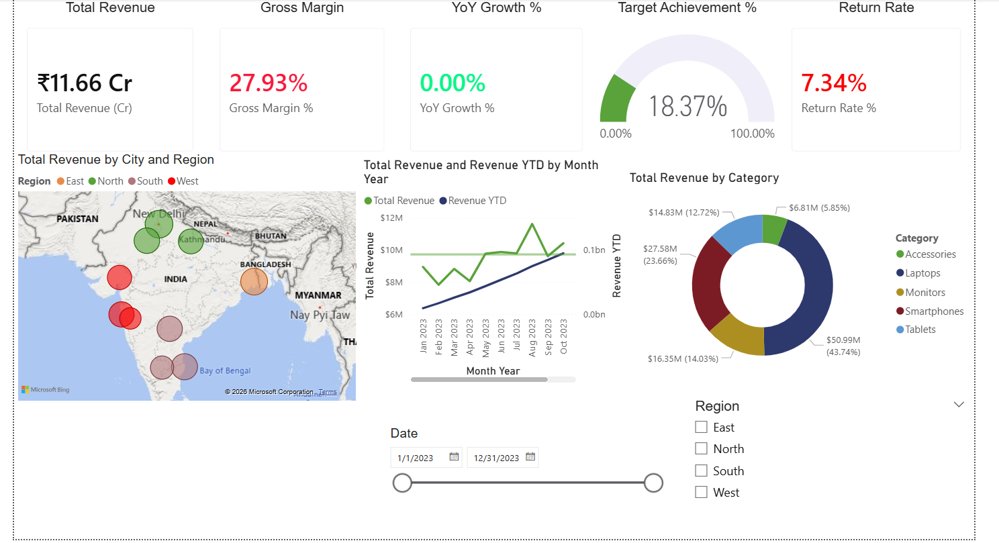
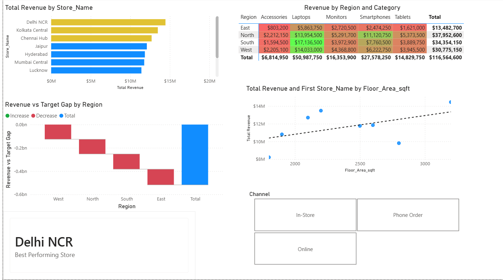
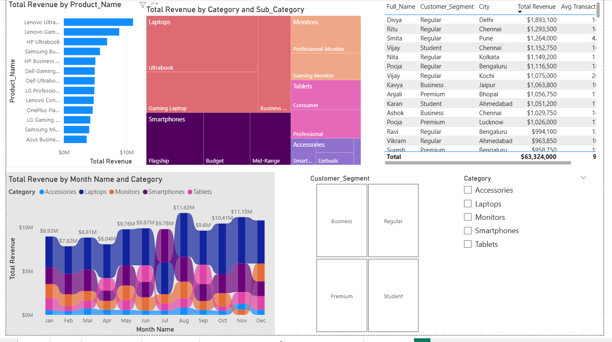
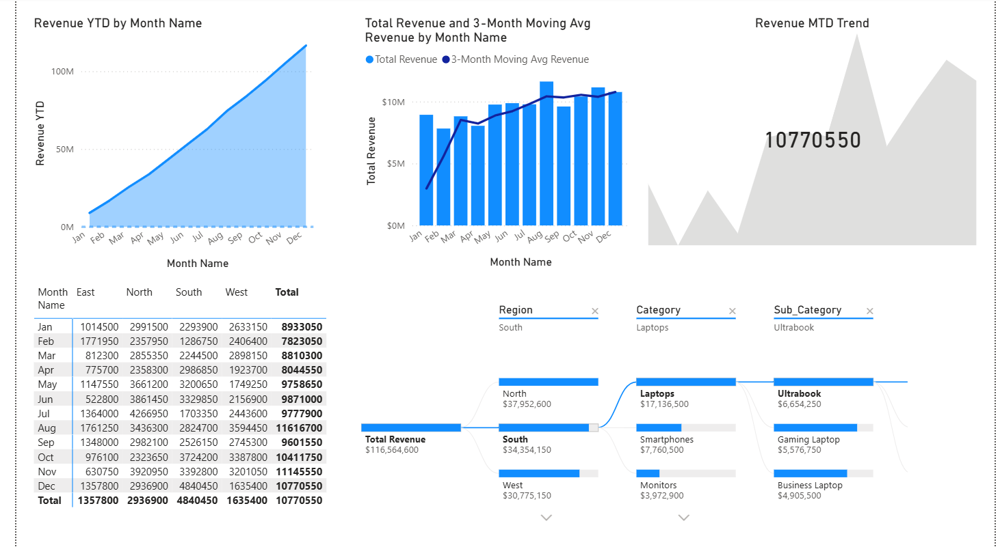
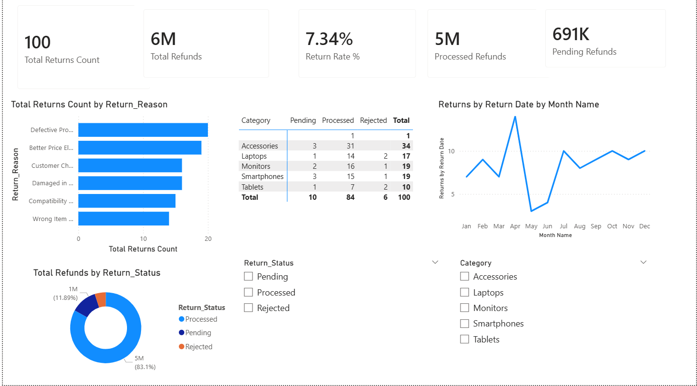

# NovaTech Electronics Sales Analysis

## Project context

Power BI analytics portfolio project completed through hands-on training using a
provided electronics-retail case study.

## Project overview

This project uses a provided electronics-retail case study to analyze sales,
profitability, regional performance, targets, customer patterns, and product returns.
The final Power BI report contains five dashboard pages for executive, regional,
product, time, and returns analysis.

## Business questions

- How are revenue, cost, profit, and margin performing?
- Which regions, stores, products, and customers contribute to performance?
- How does actual revenue compare with targets?
- How do sales change over time and by channel?
- Which products or categories show notable return patterns?

## Tools and techniques

- Power BI Desktop
- Power Query for data cleaning and transformation
- DAX measures and time-intelligence calculations
- Star-schema data modeling
- Provided CSV and Excel files

## What I did

- Imported and transformed multiple CSV and Excel tables in Power Query.
- Corrected data types, text inconsistencies, and duplicate records.
- Appended the two sales tables and merged related product information.
- Built a data model connecting sales with product, customer, store, target,
  returns, and date information.
- Created DAX measures for revenue, cost, profit, margin, targets, returns,
  ranking, and time analysis.
- Designed five dashboard pages for different business questions.

## Dashboard previews

### Executive summary

### Store and regional performance

### Product and customer analysis

### Time analysis

### Returns tracker

## Key findings

The completed project document records these results from the 2023 model and
interactive dashboards:

- The West region had the highest gross margin at 28.57%, while the North region
  generated the highest revenue at approximately ₹3.80 crore.
- Overall target achievement was 18.37%; the East region was furthest behind at
  9.1% achievement.
- Monitors had the highest return rate at 9.0%, while Accessories recorded the
  highest number of returns.
- The store-size relationship with revenue was weak across all stores but became
  positive after excluding two stores with zero recorded floor area.
- August generated the highest monthly revenue and was also the month closest to
  its target.
- In-store sales contributed 63.5% of revenue, compared with 21.6% online and
  14.9% by phone.
- The three highest-revenue customers in the report all belonged to the Regular
  customer segment.
- Smartwatch was the highest-performing Accessories sub-category.
- Pune City (ST005) was identified in the report as the store requiring review.
- The three-month moving average was approximately ₹1.08 crore per month in Q4,
  compared with ₹0.85 crore in Q1, an increase of about 26%.

## Repository contents

- `images/` - five dashboard screenshots extracted from the final project write-up
- `NovaTech_Electronics_PowerBI_Analytics_Bootcamp_Project.docx` - project report,
  dashboard pages, DAX measures, and documented findings

## Files to add after verification

- `powerbi/novatech-sales-analysis.pbix` - verified Power BI project file
- `project-report.pdf` - verified PDF export of the project report

## Data and limitations

The provided case-study data covers a limited period and does not support every
year-over-year comparison. Source data is included only if public sharing is permitted.

The instructor solution, answer key, and step-by-step guide are intentionally excluded.
